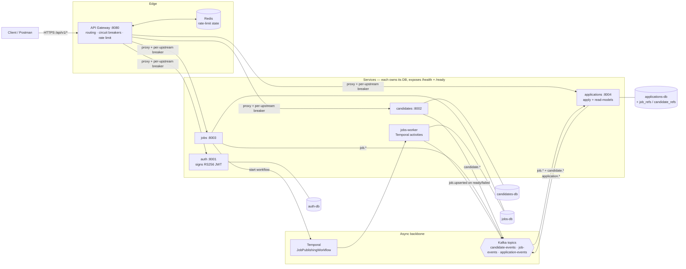
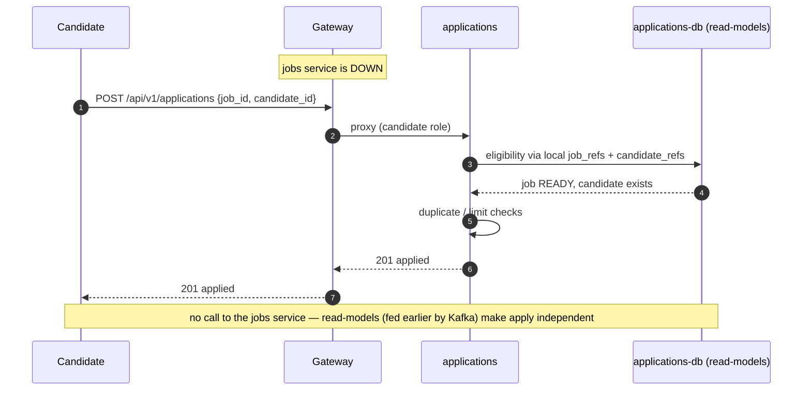

# SmartHire — Architecture

SmartHire is a **fault-isolated microservices** backend for recruitment
automation, built as a **monorepo** (uv workspace). It implements the Week 1–2
scope (job & candidate management, JWT auth + RBAC, the candidate application
workflow, and a Temporal-orchestrated job publishing pipeline) as five
independently deployable services.

Companion docs: [microservices.md](microservices.md) (run guide + fault-isolation
walkthrough) · [IMPLEMENTATION.md](IMPLEMENTATION.md) (per-file reference).

## 1. Design goals

- **Fault isolation** — if one service is down, the others keep working.
- **Scalability** — async everywhere; long-running work off the request path.
- **Consistency where it matters** — strong within a service (its own DB), and
  eventual across services (via events), which is the right trade for this domain.
- **Clean separation of concerns** — one bounded context per service.

## 2. System overview

```
                         ┌────────────────────────────┐
   client ────────────▶  │  gateway  (FastAPI, :8080) │  JWT-aware proxy,
                         │  circuit breakers, rate    │  per-upstream breakers
                         │  limiting (Redis)          │
                         └──┬─────────┬─────────┬──────┬──────────┘
             ┌──────────────┘         │         │      └───────────────┐
             ▼                        ▼         ▼                      ▼
        ┌─────────┐            ┌────────────┐ ┌──────────┐      ┌──────────────┐
        │  auth   │            │ candidates │ │  jobs    │      │ applications │
        │ :8001   │            │  :8002     │ │ :8003    │      │  :8004       │
        │ RS256   │            │            │ │ +Temporal│      │ +read-models │
        └────┬────┘            └─────┬──────┘ └────┬─────┘      └──────┬───────┘
          auth-db               candidates-db    jobs-db          applications-db
                                      │              │                  ▲
                                      │ candidate.*  │ job.*            │ consumes
                                      └──────────────┴───────▶ Kafka ───┘ job.*, candidate.*
                                                               ▲   │
                                              application.* ────┘   └──▶ (future: notifications,
                                                                          scoring, analytics)
        Temporal ◀── jobs service starts JobPublishingWorkflow; jobs-worker runs it
```

Every service = FastAPI app + its own PostgreSQL database + Alembic + `/health`
(liveness) and `/ready` (dependency check). Shared cross-cutting code lives in
`libs/smarthire_common`.

### 2.1 Detailed component diagram



Notes: all services **verify** JWTs locally with auth's public key — there is no
runtime call to auth (stateless). Solid arrows to `Kafka`/`Temporal` are the
async backbone; solid `---` lines are a service to its **own** database. No
cross-service database links exist.

## 3. Services & data ownership

| Service | Port | Owns (DB) | Responsibilities | Publishes | Consumes |
| --- | --- | --- | --- | --- | --- |
| **gateway** | 8080 | — | routing, JWT-aware proxy, per-upstream circuit breakers, Redis rate limiting | — | — |
| **auth** | 8001 | `auth` (users) | register / login / refresh / me; **signs** RS256 JWTs | — | — |
| **candidates** | 8002 | `candidates` (candidates, profiles) | candidate + profile CRUD | `candidate.*` | — |
| **jobs** (+ worker) | 8003 | `jobs` (jobs) | job CRUD + Temporal publishing (`processing → ready`) | `job.*` | — |
| **applications** | 8004 | `applications` (applications + `job_refs`/`candidate_refs` read-models) | apply, stage transitions, withdraw | `application.*` | `job.*`, `candidate.*` |

**Database per service** is the backbone of fault isolation: no shared DB failure
domain, and no cross-service JOINs. IDs that point at other services
(`recruiter_id`, `job_id`, `candidate_id`) are plain UUIDs, **not** foreign keys.

## 4. Request/data flow inside a service

```
HTTP → gateway → router → service → repository → (its own) PostgreSQL
                            │
                            ├─ raises SmartHireError → JSON error (handler)
                            └─ publishes domain events → Kafka (fail-soft)
```

Each service keeps the same layering: **router** (HTTP + access control),
**service** (business rules), **repository** (SQL), **models** (ORM).

## 5. Authentication & authorization (RS256)

- **Asymmetric JWT.** The **auth** service holds the private key and signs access
  (~15 min) + refresh (~7 day) tokens. Every other service verifies with the
  **public key** only (`smarthire_common.security.build_security`). Consequence:
  auth being down does not stop other services from validating requests.
- **Stateless.** Tokens carry `sub` (user id), `role`, `type`, `exp`, `jti`;
  verification needs no DB call on the hot path.
- **RBAC.** `require_role(...)` guards routes — recruiters manage jobs and view
  the candidate pool; candidates apply and manage their own data. The gateway
  proxies the `Authorization` header; each service enforces its own rules
  (defence in depth).
- **Passwords** are Argon2id (`pwdlib`), stored only by auth.

## 6. Workflows

### Candidate application workflow (applications service)

`POST /applications` runs its rules in order: **eligibility** (candidate + job
exist locally and the job is `published`/`ready`) → **duplicate handling** (DB
`UNIQUE(job_id, candidate_id)`; an `Idempotency-Key` turns a retry into a safe
no-op, else 409) → **application limit** (cap on active applications). It then
walks a validated state machine (`applied → screening → interview → offer →
hired`, plus `rejected`/`withdrawn`), appending each transition to
`stage_history`. Eligibility is checked against **local read-models**, so applying
survives Jobs/Candidates downtime.

### Job publishing workflow (jobs service + Temporal)

```
POST /jobs/{id}/publish  → status: processing (committed), returns 202
      ▼ (Temporal)
   breakdown_job → extract_job_skills_keywords → mark_job_ready   → status: ready
        └──────── on failure (after retries) ──▶ mark_job_failed  → status: failed
```

Each activity is **idempotent** and **retried** by Temporal; a partial failure
ends as `failed`, never a half-written `ready`. Content breakdown + skill/keyword
extraction are **heuristic (no GenAI)** — GenAI is Part B (Weeks 4–5).

## 7. Event-driven integration (Kafka)

- Topics: `candidate-events`, `job-events`, `application-events`. Every message is
  an `EventEnvelope` (`event_id`, `type`, `occurred_at`, `data`).
- The **applications** service consumes `job.upserted`/`job.deleted` and
  `candidate.upserted`/`candidate.deleted` into local `job_refs`/`candidate_refs`
  tables. Handlers are **idempotent** (upsert/delete by id), so redelivery is safe.
- The producer/consumer are **fail-soft**: a Kafka outage degrades eventing
  (read-models go stale) but never crashes a service.
- Trade-off: **eventual consistency** — a just-published job may take a moment to
  become applyable. Acceptable for this domain.

## 8. The gateway & resilience

- One `Upstream` (with its own async circuit breaker) per service. A failing
  service trips only its breaker → fast **503** on that service's routes; the
  gateway's `/health` and other routes stay up.
- A single catch-all route under `/api/v1` dispatches by the first path segment,
  so collection roots (`POST /api/v1/jobs`) and sub-paths
  (`GET /api/v1/jobs/{id}`) both route correctly.
- Redis-backed rate limiting that **fails open** if Redis is unavailable.

## 9. Shared library (`libs/smarthire_common`)

`config` (base settings + key loading) · `database` (async engine/session/Base
factories) · `security` (RS256 sign/verify, `CurrentIdentity`, `require_role`,
Argon2) · `events` (Kafka producer/consumer, `EventEnvelope`, topic + type
constants) · `enums` (`Role`) · `pagination` · `exceptions` · `logging`.

## 10. Repository layout (monorepo, uv workspace)

```
smarthire/
├── libs/smarthire_common/          # shared library (installed into the venv)
├── services/{gateway,auth,candidates,jobs,applications}/
│       app/…  migrations/  tests/  Dockerfile  pyproject.toml  .env.example
├── keys/                           # dev RS256 keypair (gitignored)
├── scripts/generate-keys.sh
├── docker-compose.yml
└── pyproject.toml                  # workspace root (package = false)
```

`package = false` on the root and services: they run from source (local `app/`),
so the same top-level `app` package name in each service doesn't collide in the
shared venv; only `smarthire_common` is installed as an importable package.

## 11. Key decisions & trade-offs

- **Monorepo, not polyrepo** — atomic cross-service commits (e.g. an event-schema
  change touches producer + consumers in one PR), one `docker compose`, shared
  library without version churn. Repo layout ≠ deployment coupling: each service
  still deploys independently.
- **DB-per-service + events over sync calls** — maximum isolation; the cost is
  eventual consistency and read-model duplication.
- **RS256 over shared-secret HS256** — no shared secret; verification survives
  auth downtime.
- **Temporal for publishing** — durable, retriable, observable long-running work.

## 12. Roadmap

| Week | Focus | Status |
| --- | --- | --- |
| 1 | Foundation + job/candidate management | ✅ (services) |
| 2 | Application workflow + Temporal publishing | ✅ (services) |
| — | Microservices decomposition (fault isolation) | ✅ |
| 3 | Kafka events · background workers · observability | events ✅; `notifications`/`scoring`/`analytics` + OTel/Prometheus/Jaeger next |
| 4 | Embeddings + semantic search | planned (`search` service, vector DB) |
| 5 | AI assistant + recommendations | planned (`ai-assistant` service, LangGraph) |

New Week 3–5 capabilities land as **new services** consuming existing events —
without modifying the current ones, which is the payoff of the event-driven split.

## 13. Sequence diagrams

### 13.1 Job publishing (async, via Temporal)

```mermaid
sequenceDiagram
  autonumber
  participant R as Recruiter
  participant G as Gateway
  participant J as jobs
  participant T as Temporal
  participant W as jobs-worker
  participant K as Kafka
  R->>G: POST /api/v1/jobs/{id}/publish
  G->>J: proxy (recruiter role)
  J->>J: status = processing (committed)
  J->>T: start JobPublishingWorkflow(job_id)
  J-->>G: 202 Accepted (processing)
  G-->>R: 202 Accepted
  T->>W: breakdown_job
  T->>W: extract_job_skills_keywords
  T->>W: mark_job_ready
  W->>J: (writes jobs-db) status = ready
  W->>K: publish job.upserted(ready)
  Note over T,W: any step fails → retried; exhausted → mark_job_failed (never a half-written "ready")
```

### 13.2 Apply — resilient while the jobs service is DOWN



### 13.3 Gateway fault isolation (a downstream is down)

```mermaid
sequenceDiagram
  autonumber
  participant U as Client
  participant G as Gateway
  participant X as jobs (down)
  U->>G: GET /api/v1/jobs
  G->>X: forward (via jobs breaker)
  X--xG: connection refused
  G-->>U: 503 (fast) — breaker records failure
  Note over G: after N failures the breaker OPENS → subsequent /jobs calls 503 immediately;<br/>/health and other services' routes stay 200
```
